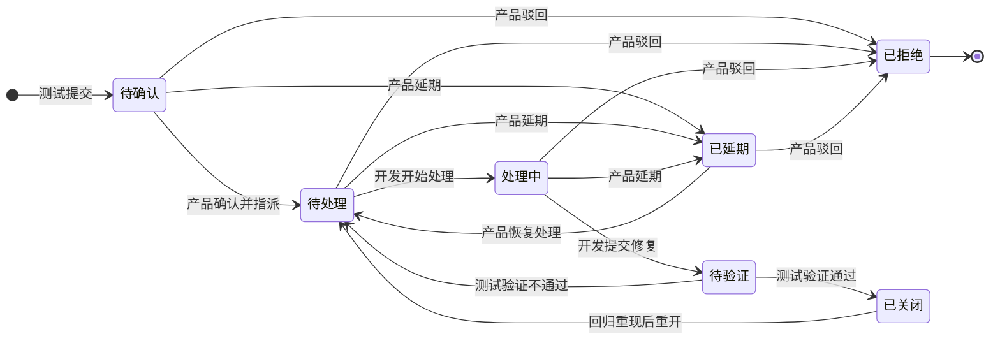

# DefectFlow · 研发缺陷协作看板

一个轻量的缺陷（Bug）协作系统演示：测试提交缺陷 → 产品确认与指派 → 开发处理 → 测试验证，全程以状态机约束流转，并用审计日志记录每一次操作。

## 功能特性

- 三种角色协作：测试、产品、开发，页面右上角随时切换身份
- 状态看板：待确认 → 待处理 → 处理中 → 待验证 → 已关闭（另有已延期/已拒绝）
- 服务端强约束的状态机与角色权限，前端只展示“当前身份可执行”的操作
- 缺陷详情抽屉：基本信息、缺陷描述、可执行操作、不可变流转记录
- 演示数据覆盖每个状态，开箱即可看到完整流程
- 纯 Python 标准库 + SQLite，无第三方依赖

## 快速开始

```bash
python server.py            # 默认 127.0.0.1:8000
python server.py --reset    # 删除旧数据并重建演示数据
python server.py --port 9000
```

浏览器打开 <http://127.0.0.1:8000>。

## 演示身份

| 角色 | 演示账号 | 主要权限 |
| --- | --- | --- |
| 测试 | 林小测 / 周小测 | 提交缺陷、验证通过/不通过、重开回归缺陷 |
| 产品 | 王产品 | 确认并指派、延期、驳回、恢复处理 |
| 开发 | 张开发 / 陈开发 | 仅能开始处理并修复指派给自己的缺陷 |

## 一条完整闭环

1. 切到“测试”身份，点「提交新缺陷」；
2. 切到“产品”，在待确认列打开缺陷，执行「确认并指派」（选择优先级和开发）；
3. 切到“开发”（选择被指派人），执行「开始处理」→「提交修复」；
4. 切到“测试”，验证通过即关闭；若验证不通过，缺陷自动回到“待处理”；
5. 已关闭缺陷回归复现时，测试/产品可填写原因「重开缺陷」。

## 目录结构

```text
defect-collab/
├── server.py              # 后端：REST API + SQLite + 状态机规则
├── static/
│   ├── index.html         # 单页看板
│   ├── style.css
│   └── app.js
├── docs/
│   └── design.md          # 状态机图 + 设计思考（Mermaid 渲染）
├── scripts/
│   └── smoke_test.py      # API 生命周期冒烟测试
└── defect.db              # 首次启动自动生成
```

## 测试

先启动服务，再运行：

```bash
python scripts/smoke_test.py
```

测试覆盖：测试提交 → 产品确认 → 越权校验 → 开发修复 → 验证失败重开 → 再次修复 → 关闭 → 回归重开 → 无理由驳回被拒绝。

## 状态机说明

状态流转图与设计思路见 [docs/design.md](docs/design.md)。



## API

| 方法 | 路径 | 说明 |
| --- | --- | --- |
| GET | `/api/users` | 用户列表 |
| GET | `/api/bugs` | 缺陷列表 |
| POST | `/api/bugs` | 提交缺陷（body 带 `user_id`） |
| GET | `/api/bugs/{id}?as={user_id}` | 详情与可执行动作 |
| POST | `/api/bugs/{id}/actions` | 状态流转 |

动作示例：

```json
{ "user_id": 3, "action": "triage", "priority": "P1", "assignee_id": 4, "comment": "优先处理" }
```
